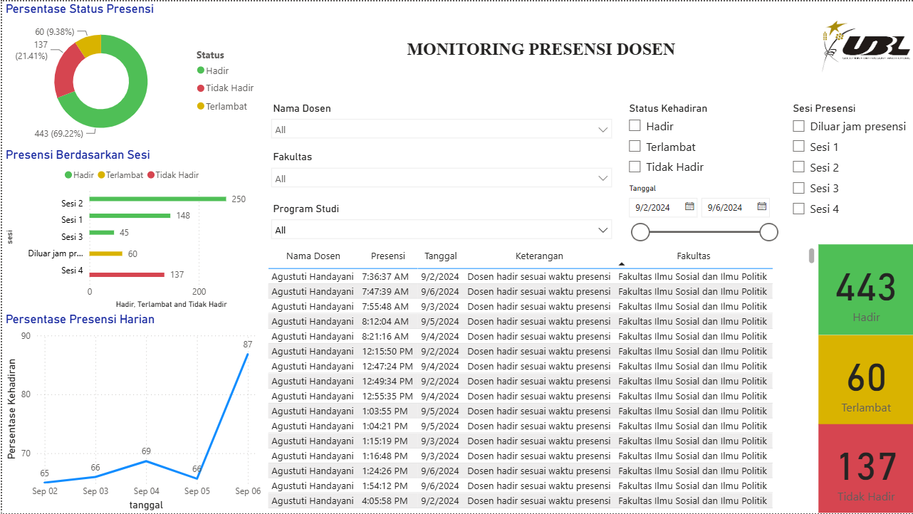
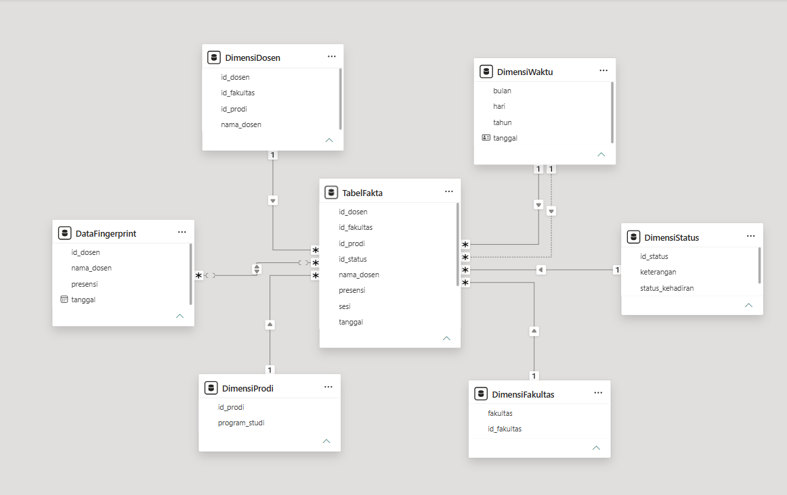

# Monitoring Presensi Dosen (Dashboard Power BI berbasis OLAP)

Dashboard interaktif untuk memantau kehadiran dosen di Universitas Bandar Lampung, dibangun dengan **Power BI** menggunakan pendekatan **OLAP** (star schema, slice, dice, dan drill-down).

Proyek ini merupakan bagian dari Penulisan Ilmiah berjudul *"Analisis Penggunaan OLAP untuk Monitoring Presensi Dosen"* (Program Studi Sistem Informasi, Fakultas Ilmu Komputer, Universitas Bandar Lampung, 2025).


[](https://youtu.be/YMJkGhaIAN0)


## Latar Belakang

Rekap presensi dosen dari mesin fingerprint sebelumnya diolah manual di Excel. Cara ini memakan waktu (sekitar 4 hari untuk rekap 1 minggu data), rentan human error, dan sulit dianalisis. Dashboard ini dibuat agar pihak manajemen dapat melihat pola kehadiran dosen secara visual, dinamis, dan interaktif.

## Fitur

- **Kartu ringkasan**: jumlah presensi Hadir, Terlambat, dan Tidak Hadir.
- **Donut chart**: persentase status presensi.
- **Bar chart horizontal**: presensi berdasarkan sesi (Sesi 1-4 dan di luar jam presensi).
- **Line chart**: persentase kehadiran harian.
- **Tabel detail**: nama dosen, waktu presensi, tanggal, keterangan, dan fakultas.
- **Filter (slicer)**: nama dosen, fakultas, program studi, status kehadiran, sesi presensi, dan rentang tanggal.

## Operasi OLAP yang Diterapkan

| Operasi | Contoh penerapan |
|---------|------------------|
| **Slice** | Memfilter satu dimensi, misalnya hanya fakultas tertentu atau satu dosen. |
| **Dice** | Menggabungkan beberapa filter, misalnya status "Terlambat" + fakultas + rentang tanggal. |
| **Drill-down** | Sesi → Fakultas → Program Studi → Dosen, dan Tanggal → Hari. |

## Dataset

- Sumber: data fingerprint dosen (Excel `.xlsx`) dan data unit kerja dosen.
- Periode: 2-6 September 2024.
- Total awal 642 data presensi, menjadi **640** setelah penghapusan duplikat.
- Cakupan: 28 dosen, 3 fakultas, 7 program studi.

> **Catatan:** Data asli berisi informasi pribadi dosen sehingga **tidak disertakan** dalam repositori ini.

## Proses ETL (Power Query)

1. **Extract**: mengambil data dari Excel Workbook.
2. **Transform**:
   - Menghapus duplikat pada kolom `Date/Time`.
   - Memfilter data satu minggu (2-6 September 2024).
   - Merapikan teks dengan *Replace Values* dan mengganti nama kolom (`Name` → `nama_dosen`, `ID` → `id_dosen`).
   - Memisahkan `Date/Time` menjadi kolom `tanggal` dan `presensi` (Split Column by Delimiter).
   - Menambahkan kolom `sesi` dan `id_status` dengan Custom Column.
3. **Load**: memuat data ke model Power BI.

### Aturan Sesi Presensi

| Sesi | Waktu |
|------|-------|
| Sesi 1 | Sebelum atau tepat pukul 08.00 WIB |
| Sesi 2 | 12.00 - 13.00 WIB |
| Sesi 3 | 13.00 - 16.00 WIB |
| Sesi 4 | Setelah pukul 16.00 WIB |
| Di luar jam presensi | Waktu lainnya |

### Status Kehadiran

| id_status | Status | Keterangan |
|-----------|--------|------------|
| 1 | Hadir | Presensi sesuai waktu sesi |
| 2 | Terlambat | Presensi setelah batas waktu |
| 3 | Tidak Hadir | Tidak ada data presensi untuk sesi tersebut |

## Model Data (Star Schema)

Satu tabel fakta (`TabelFakta`) dihubungkan dengan tabel dimensi:

- `DimensiDosen`
- `DimensiFakultas`
- `DimensiProdi`
- `DimensiStatus`
- `DimensiWaktu`
- `DataFingerprint`



## Contoh Measure DAX

```dax
Hadir =
COUNTROWS(
    FILTER(
        TabelFakta,
        RELATED(DimensiStatus[status_kehadiran]) = "Hadir"
    )
)

Total Status = COUNTROWS(TabelFakta)

Persentase Kehadiran =
DIVIDE(
    COUNTROWS(
        FILTER(
            TabelFakta,
            RELATED(DimensiStatus[status_kehadiran]) = "Hadir"
        )
    ),
    COUNTROWS(TabelFakta),
    0
) * 100
```

## Teknologi

- Microsoft Power BI Desktop (Power Query, Power Pivot, DAX)
- Microsoft Excel (sumber data)

## Cara Menjalankan

1. Pasang [Power BI Desktop](https://powerbi.microsoft.com/desktop/).
2. Unduh atau clone repositori ini.
3. Buka file `.pbix` di Power BI Desktop.
4. Jika diminta, arahkan sumber data ke file Excel milik Anda dengan struktur kolom yang sama (`Name`, `ID`, `Date/Time`, serta data unit kerja dosen).

## Keterbatasan dan Pengembangan Selanjutnya

- Dashboard belum menampilkan data secara *real time*.
- Belum dapat mengidentifikasi dosen yang sama sekali tidak melakukan presensi di mesin fingerprint.
- Rencana: fitur pengajuan izin melalui sistem dengan unggah bukti pendukung, tersimpan dalam database.

## Penulis

**Ester Belen Wijaya**
Program Studi Sistem Informasi, Fakultas Ilmu Komputer, Universitas Bandar Lampung

Dosen Pembimbing: Ayu Kartika Puspa, S.Kom., M.T.I.
